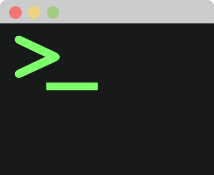

  
  

  

# Welcome to BashFolio :computer:

This repository serves as my interactive portfolio where you can explore all my projects, publications, and even download my resume.

## Accessing the Portfolio Terminal :rocket:

You can access my Portfolio Terminal by clicking the link below:

[**Explore My Portfolio Terminal**](https://andreamazzeo289.github.io/BashFolio/)

## How to Use :information_desk_person:

Once you enter the Portfolio Terminal, it will resemble a bash terminal. 

You can navigate and explore various sections using the commands listed below:

- `projects` - List all available projects
- `publications` - List all available publications.
- `social` - Show the main social network link.
- `resume` - Download my resume in PDF format.